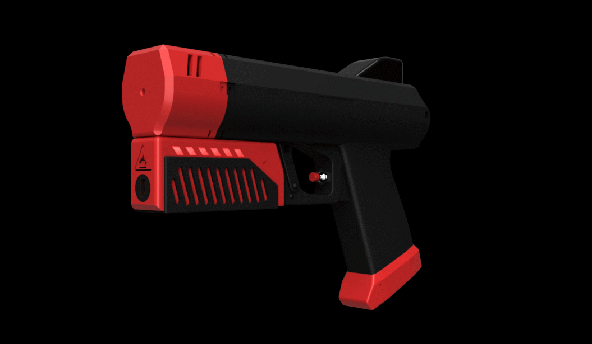
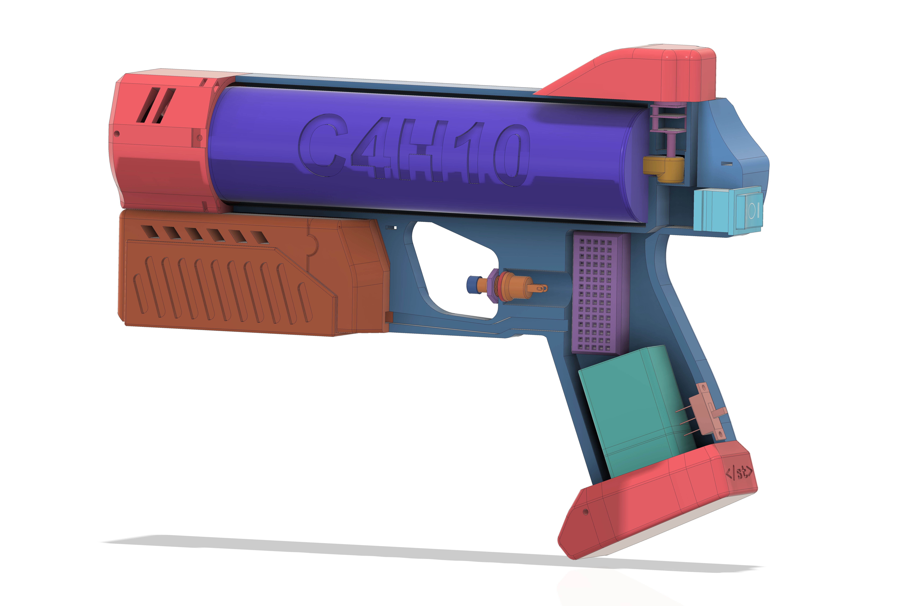

# DIY Flamethrower

  

**The Samson Taxon Flamethrower**  - Personal, handheld, butane fueled, 3D printed personal flamethrower!

Great for cooking, cleaning, and tons of recreational activities! 

  

  

  

## How it works
The 3D Printed shell houses a full 135ml can of butane which rests in the printed nozzle. The can is actuated by an N20 geared motor and the butane is ignited via a plasma arc in the path of the spray. All of the electronics are code-free and clearly layed out in [Wiring]()

This version has no metal fastners. Just 3d printed links and clever ziptie usage.

 

*[YouTube link]()*

## The Build
Detailed assembly instruction are given in the [Wiki](). Please follow each step to complete the build and start THROWING FLAMES! Safely of course :)

[1. Hardware Setup]()

[2. Materials needed]()

[3. Safety and Usage Guide]()

[4. Customize and Share]()

---
More about me:

